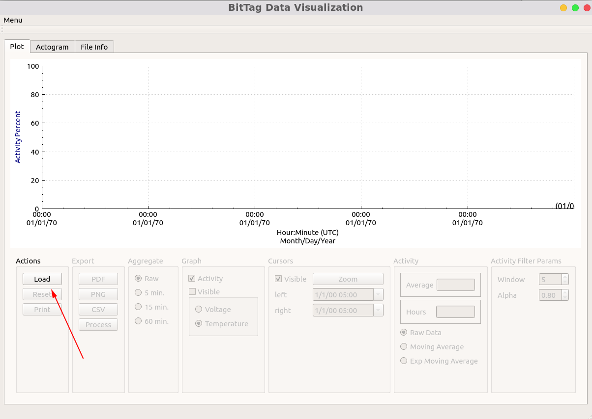
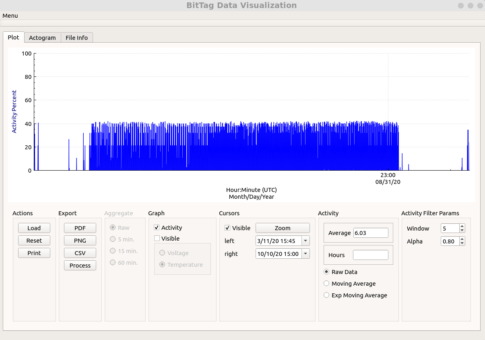
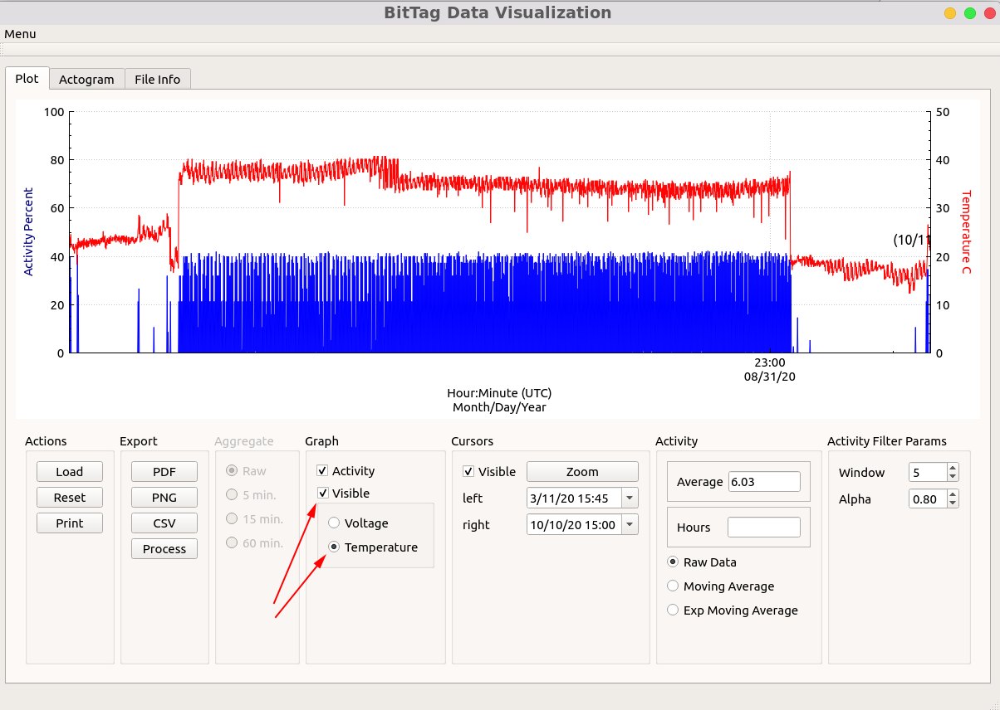
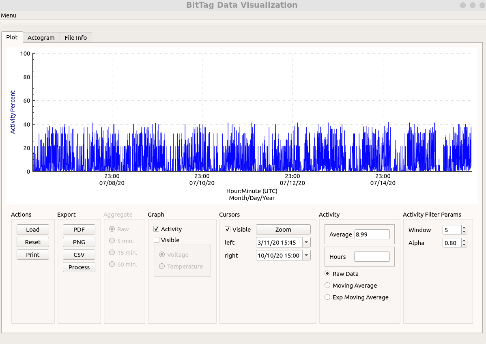
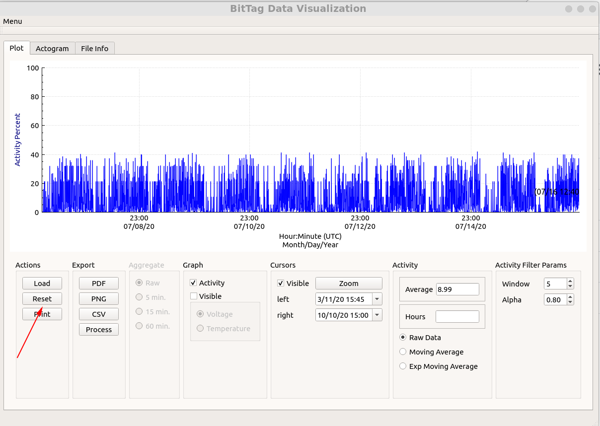
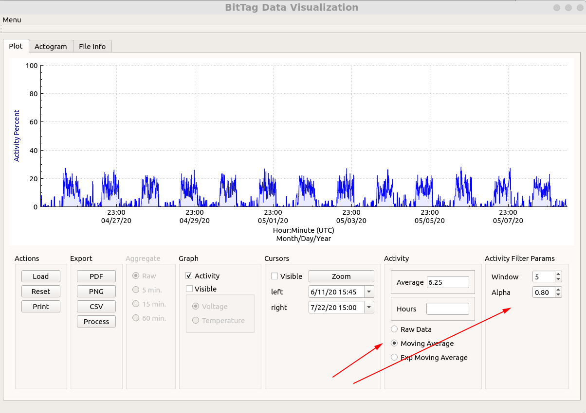
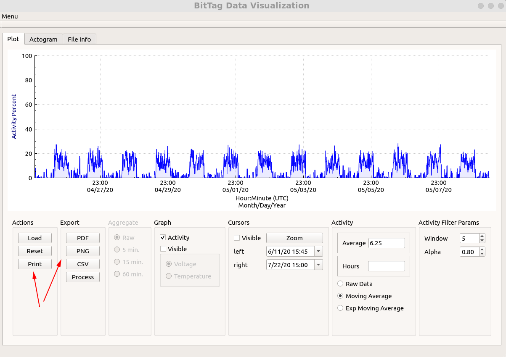
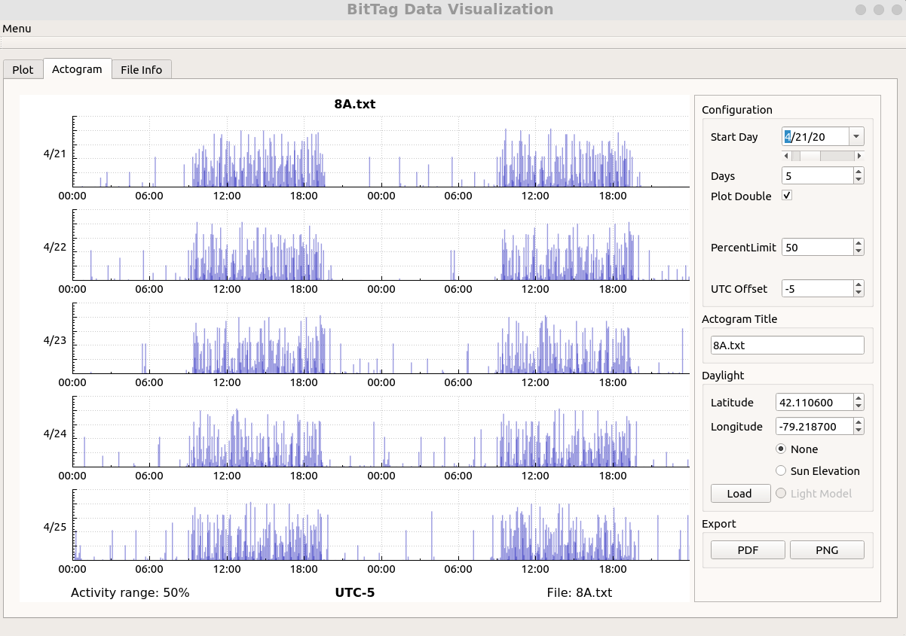
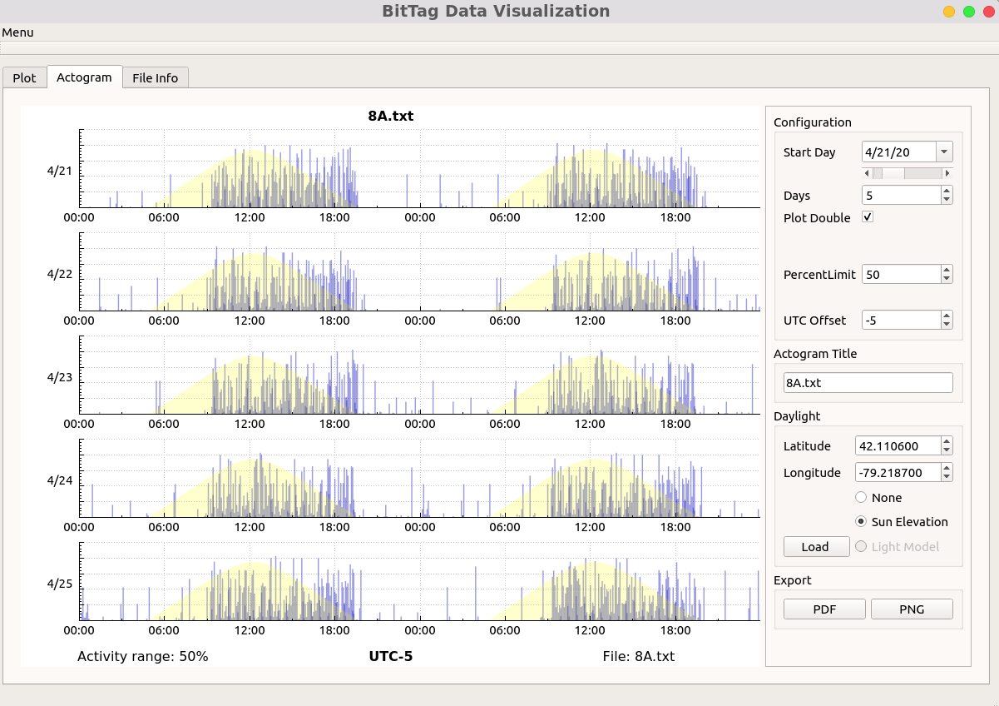
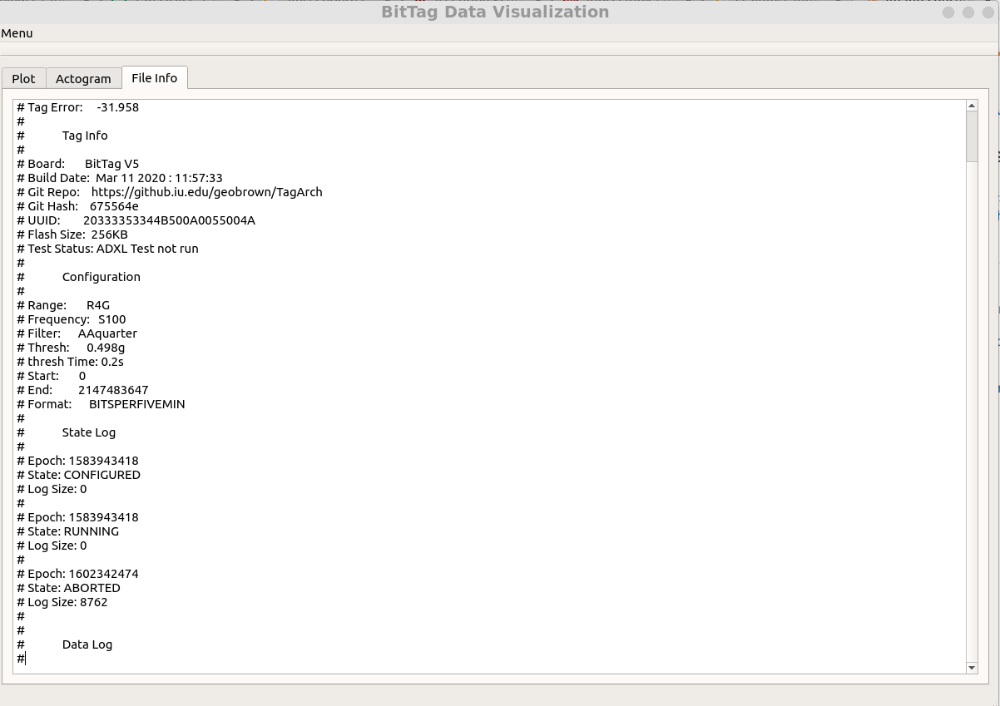

# Visualization

The BitTag visualization application (btviz) allows exploration of data files created using the BitTag monitor.  The tool provides mechanisms to graphically explore data by "zooming" in on regions of interest, to visualize the data via actograms, and to generate graphics (png) files from the user defined graphs.  In addition, the data exploration tool supports data aggregation and smoothing.


## 1. Loading

When the tool is opened, the initial screen provides a single action -- load (Fig. 1)


<figure align="center">

<figcaption align="center">Fig. 1: btviz Start Screen</figcaption>
</figure> 


The load action will open a dialog that filter '.txt' files -- the files created by the tag monitor tool are all human readable text files.  When a file is opened, the activity data for the full time range are displayed.  (Fig. 2)

<figure align="center">
 
<figcaption> Fig 2: Raw Data</figcaption>
</figure> 


Notice that in this example, there are three distinct regions -- the first and last have minimal activity and the middle has a great deal of activity.  The first and last regions correspond to pre and post experiment -- the tag was active, but not on a bird !  It's easy to demonstrate this by displaying the tag temperature data (Fig. 2).

The data are displayed as "percentages".  To understand what this means, consider that the BitTags collect activity data as counts of active seconds in a given collection period (for example, 5 minutes).  The activity percentage in a collection period is computed by dividing the count by the length of the collection period (in seconds).

<figure align="center">
 
<figcaption> Fig 3: Temperature</figcaption>
</figure> 

Notice that in the middle period, the temperature is around 38C -- corresponding (roughly) to a Junco's body temperature.  With captive animals, a common issue is the loss of a tag due to harness failure.  If the tag is recovered, the temperature data is important for selecting the valid data periods.  The visualization tool also can display the tag battery voltage -- this is important for understanding battery lifetimes.

## 2. Zooming and Scrolling

At the default scale with a long collection period, it is difficult to see any patterns.  The tool supports "zooming" and scrolling in the data. Using the mouse buttons/track pad/scroll wheel -- some experimentation my be required to determine how to do this on the various platforms on which the tool runs !  For example, the Fig. 4 shows the data for roughly one week.

<figure align="center">
 
<figcaption> Fig. 4: Zoom and Scroll</figcaption>
</figure> 


To return to the full data screen, use the "reset" button (Fig. 5)

<figure align="center">
 
<figcaption> Fig. 5: Reset to Full View</figcaption>
</figure> 

It is also possible to zoom to a pair of cursors (set with the left, right mouse buttons -- os x ctl + click )  or by setting the desired dates.
(Fig. 6)

<figure align="center">
 
<figcaption> Fig. 6:  Using Cursors</figcaption>
</figure> 


## 3. Data Smoothing

Sometimes it is difficult to discern interesting aspects of the data because there appears to be too much noise.  In this case it may be helpful to *smooth* the data.  There are two types of smoothing filters implemented by the tool -- moving average and exponential moving average (Fig. 7).

<figure align="center">
 
<figcaption> Fig. 7:  Data Smoothing</figcaption>
</figure> 


# 4. Export Figures and Selected Data

The current graph  can be exported in several ways (Fig. 8):

* printed
* saved as a PDF file
* saved as a PNG file
* data exported to CSV


<figure align="center">
 
<figcaption> Fig. 8  Data/Graph Export</figcaption>
</figure> 


# 5. Actograms

In addition to exploring the raw data, the tool provides a means to explore via actograms (Fig. 9)

<figure align="center">
 
<figcaption> Fig. 9 Actograms</figcaption>
</figure> 


The actograms can be configured in the following ways

* start day : first day displayed
* days : number of days displayed
* single/double (24 or 48 hours)
* range as a maximum activity percent (PercentLimit)
* time zone (offset from UTC)
* title for actogram.

In addition, the actogram can display actual (for a given location) or simulated sun elevation. (Fig. 10).

<figure align="center">
 
<figcaption> Fig. 10 Sun Elevation</figcaption>
</figure> 

Simulated elevation can be used for captive animals to indicate the periods of light.  Currently,
the model is quite basic consisting of a csv (comma separated data) file containing the
start/stop data/times for periods of light.  All times are UTC.

```csv
04/01/2019 11:00:00,04/01/2019 23:59:59
04/02/2019 11:00:00,04/02/2019 23:59:59
04/03/2019 11:00:00,04/03/2019 23:59:59
04/04/2019 11:00:00,04/04/2019 23:59:59
04/05/2019 11:00:00,04/05/2019 23:59:59
```

Finally the actogram can be exported as a PDF or PNG file.

# Tag Metadata

The data files include information about the experiment configuration including collection periods, activity detection, hardware and software versions, and the final clock error (Tag error).  This information can be important for documenting the experiment.  It can also be read directly from the data file.  (Fig. 11)

<figure align="center">
 
<figcaption> Fig. 11 Tag Metadata</figcaption>
</figure> 

