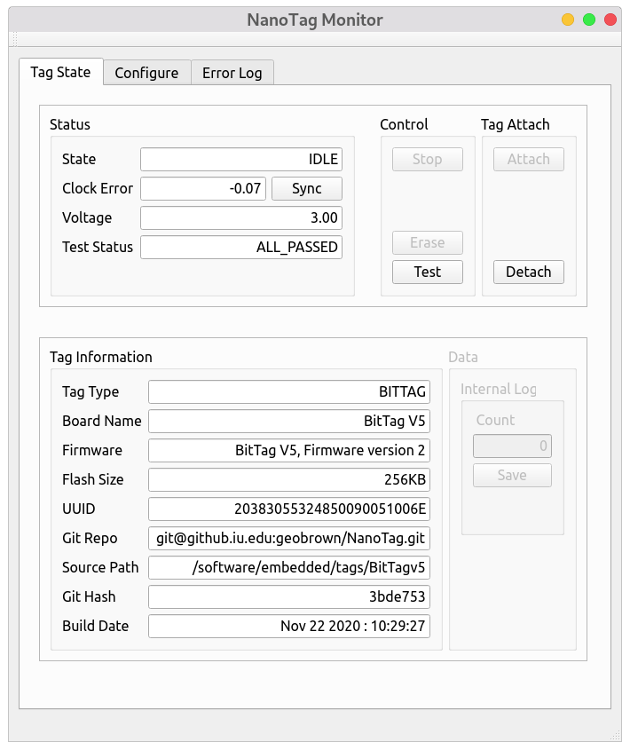
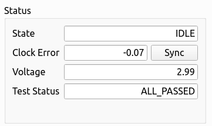
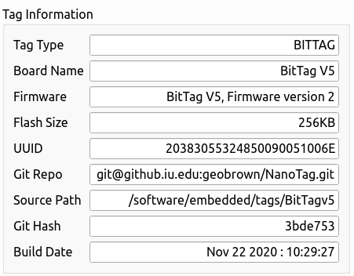
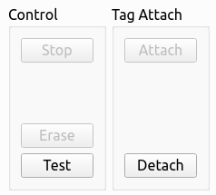
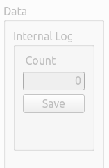
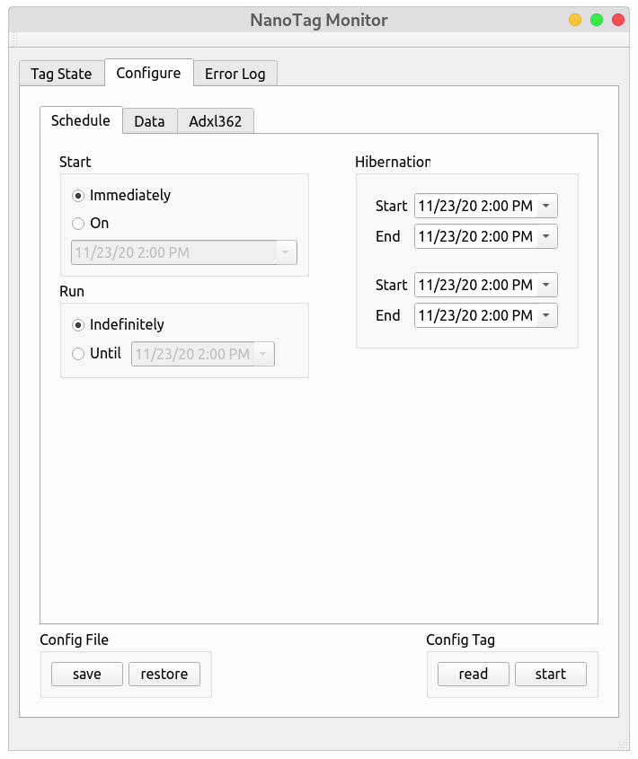
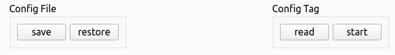
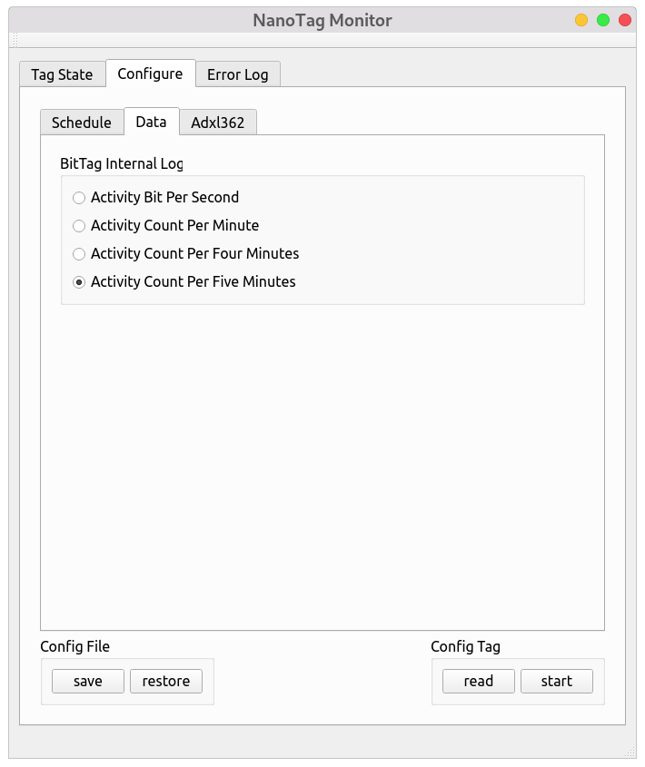
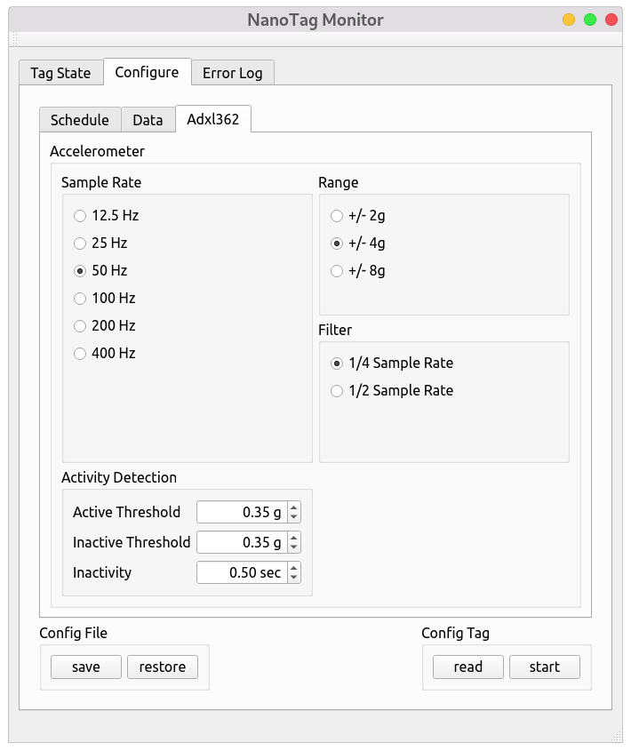
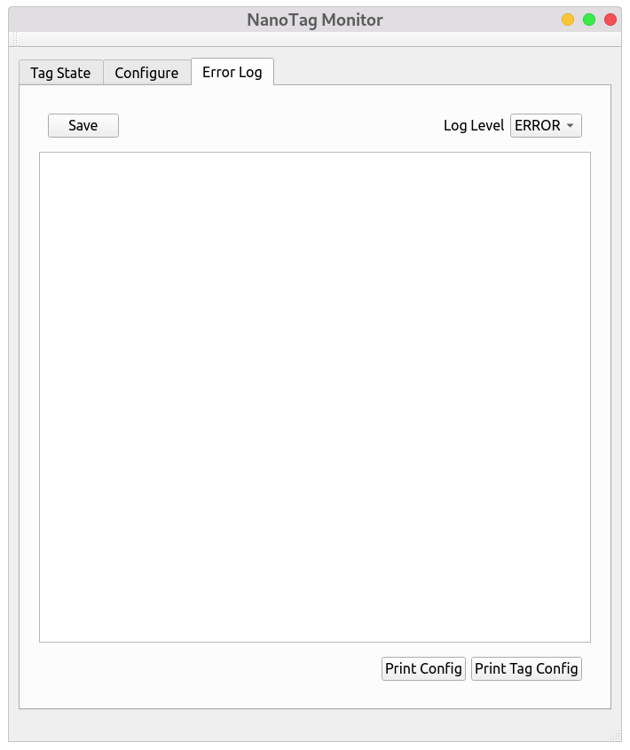

# Tag Configuration

To be usable, data logging tags require software applications to configure them prior to "flight" and to access any data collected "post-flight".  The NanoTag architecture is supported by an extensive software system that includes the base-boards used to charge the tags, a software library to support communication with the tags via a USB connection to the baseboard, and applications including a graphical user interface (GUI) tool -- the NanoTag Monitor -- and a collection of command-line tools for querying and testing tags.
Collectively, these tools support the tags through the build process and through their use in biological expariments.  In this section, we focus on the *use* of these tools rather than their underlying architecture.


## NanoTag Monitor


<div class="grid" markdown>

<div markdown>

The primary tool for use by biologists is the NanoTag monitor.   This tool, provides the ability to gather metadata about a tag (for example, it's hardware and firmware revisions), to read and write configurations used in experiments, to synchronize the on-board clock, and to access tag data post-experiment.  The monitor screen, displayed to the right, includes a number of tabs -- "Tag State", "Configure", and "Error Log" -- to access
various features.  The "Tag State" tab includes information about the the tag hardware and software,
the current tag status, and various controls.

</div>

<div markdown>

<figure align="center">

<figcaption align="center">Fig. 1  NanoTag Monitor</figcaption>
</figure>

</div>

</div>

### Tag State Tab

<div class="grid" markdown>

<div markdown>

The status area of the Tag State tab, provides the current state -- in this case "IDLE", the clock error, the current battery voltage, and the status of the tag self-tests (which should be run before deployment).  The 
tag clock can be synchronized to the host computer (Sync button).

</div>

<div markdown>

<figure align="center">

<figcaption align="center">Fig. 2  NanoTag Monitor (Status) </figcaption>
</figure>

</div>

</div>


<div class="grid" markdown>

<div markdown>

Tag Information includes the following

* Tag Type : The type of tag being accessed.
* Board Name : The specific board hardware
* Firmware   : Tag firmware (software) version
* Flash Size : Amount of storage on the tag
* UUID : The processor unique identifier which can be used to uniquely identify a specific tag
* Git Repo : The git  repository.  This can be used to retrieve the tag software and hardware sources
* Source Path:  The location of the tag software in the repository
* GitHash : The hash used to identify the specific repository contents used to build the tag software
* Build  Date:  The date when the tag software was built.

</div>

<div markdown>

<figure align="center">

<figcaption align="center">Fig. 3  NanoTag Monitor (Information) </figcaption>
</figure>

</div>

</div>

<div class="grid" markdown>

<div markdown>

The Tag State tab provides two important sets of controls.  A running tag
can be stopped (button disabled in the IDLE state), a stopped tag can be 
erased (button disabled), and self-tests can be executed (on an idle tag).
The NanoTag monitor can be Detached from the base (and subsequently Attached).  It is
advisable to Detach the base, or close the NanoTag monitor, prior to unplugging the base and
removing a tag.

</div>

<div markdown>

<figure align="center">

<figcaption align="center">Fig. 4  NanoTag Monitor (Control) </figcaption>
</figure>

</div>

</div>


<div class="grid" markdown>

<div markdown>

The final control area of the Tag State tab is the Data area.  A tag that has executed and stopped can have its data downloaded by the Data save button.  BitTags have only an internal data log, but some tags may additionally have external data logs stored in an external flash.  The count field gives an indication of the amount of data available for download.

</div>

<div markdown>

<figure align="center">

<figcaption align="center">Fig. 5  NanoTag Monitor (Data Save) </figcaption>
</figure>

</div>

</div>


### Configuration Tab


<div class="grid" markdown>

<div markdown>

The configuration tab provides several sub-tabs for configuring the data collection schedule (start/end times and
hibernation periods), the data to be logged, and tabs for configuring sensors.   The BitTag has a single sensor -- the adxl362 accelerometer, but other tags may have different or additional sensors.  The specific set of configuration sub-tabs is tag specific.

The schedule for an experiment is determined by the start and stop times and any periods when data
collection should be suspended.  It is important to remember that **all times are UTC**.   By default,
data collection begins immediately and runs until storage or energy are exhausted.  Hibernation periods
are defined by the start and end times -- the BitTag supports two such periods)
Schedule times are limited to hour level precision.

</div>

<div markdown>

<figure align="center">

<figcaption align="center">Fig. 6  NanoTag Monitor Configuration </figcaption>
</figure>

</div>

</div>


The configuration tab has two sets of controls (visible in all sub-tabs).  The current configuration 
can be saved to or restored from a file.   This is particularly useful for designing a common configuration
for multiple tags to be used in a single experiment.  A (future) command-line tool will use such a stored configuration to enable rapid configuration of a set of tags.

The current tag configuration can be read.  Finally,
the configuration can be written to the tag -- and consequently data collection begun -- with the **start** button.

<figure align="center">

<figcaption align="center">Fig. 7  NanoTag Monitor Configuration Controls </figcaption>
</figure>


### Data Logging Configuration

<div class="grid" markdown>

<div markdown>

The allowable log configurations are tag specific.  For the BitTag, the only configuration control
is the aggregation period.  Activity is measured on a per-second basis and may be stored as a bit-per second,
counts/minute, counts/four minutes, and counts/five minute.  The primary determining factor is the total amount of data that can be stored.  The BitTag can store approximately 15,000 data records in its internal memory.  A record consists of a time stamp, battery voltage, temperature, and some number of aggregation bits. At the highest resolution, the maximum collection period is 10 days while at the lowest resolution the tag can store a full year of data.

| Resolution         | Maximum Collection Period |
| ------------------ | ------------------------- |
| Bit/second         | 250 hours                 |
| Count/minute       | 2500 hours                |
| Count/four minutes | 332 days  |
| Count/five minutes | 364 days |

</div>

<div markdown>

<figure align="center">

<figcaption align="center">Fig. 8  NanoTag Data Logging Configuration </figcaption>
</figure>

</div>

</div>

### Sensor Configuration

<div class="grid" markdown>

<div markdown>

The BitTag only has a single sensor -- the Adxl362 accelerometer -- and is used only as an activity 
detector.  There are a number of parameters that can be configured including the accelerometer
sample rate, range (in units of gravity), and the filter.  In most instances, the default parameters are appropriate.   In addition, the activity detector can be configured by setting the thresholds for
transitions to active (active threshold), inactive (inactive threshold), and the time that a tag
must stay below the inactive threshold to return to the inactive state (inactivity).

</div>

<div markdown>

<figure align="center">

<figcaption align="center">Fig. 9  NanoTag Sensor Configuration </figcaption>
</figure>

</div>

</div>


### Error Log

<div class="grid" markdown>

<div markdown>

The primary function of the Error Log tag is to provide debugging information.  If errors occur in the monitor software, corresponding logging information is displayed in this tab.  The contents of the error log can be saved to a file.  In addition, the current tag  and monitor configurations can be printed to the log.

</div>

<div markdown>

<figure align="center">

<figcaption align="center">Fig. 10  NanoTag Error Log </figcaption>
</figure>

</div>

</div>


## Configuration Files


<div class="grid" markdown>

<div markdown>

The tag configuration can be saved (and restored from) a human-readable (JSON) file.  Notice
that every section of the configuration gui has a corresponding section in the configuration files. 
Dates/times are recorded as Unix Epochs (seconds since 1/1/1970).  These can be checked with 
an on-line tool such as [Epoch Converter](https://www.epochconverter.com).

</div>

<div markdown>

```javascript
{
 "tag_type": "BITTAG",
 "active_interval": {
  "start_epoch": 1606230000,
  "end_epoch": 1606406400
 },
 "hibernate": [
  {
   "start_epoch": 1606233600,
   "end_epoch": 1606237200
  },
  {
   "start_epoch": 1606244400,
   "end_epoch": 1606248000
  }
 ],
 "bittag_log": "BITTAG_BITSPERFIVEMIN",
 "acceltag_log": "ACCELTAG_UNSPECIFIED",
 "adxl362": {
  "range": "R4G",
  "freq": "S50",
  "filter": "AAquarter",
  "act_thresh_g": 0.35,
  "inact_thresh_g": 0.35,
  "inactive_sec": 0.5
 }
}
```

</div>

</div>

