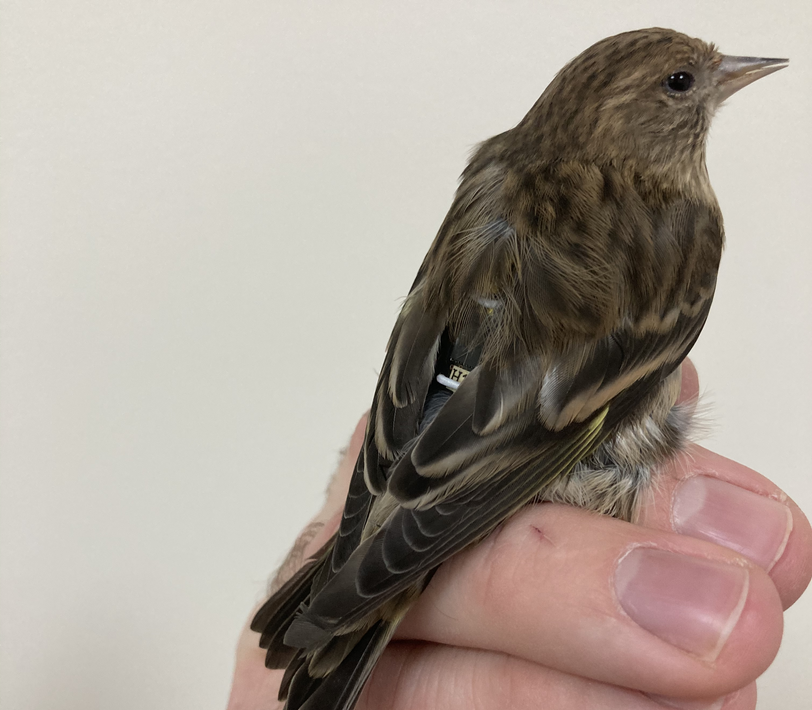
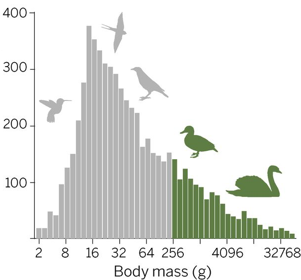

# Background

## Use of Tags in Studying Bird Behavior

<figure class="float-right ml-2" style="width: 300px;">
  
  <figcaption>Pine Siskin with tag &mdash; <em>Ben Vernasco</em></figcaption>
</figure>

Tags have long been used for studies of animal behavior; however, the past decade has seen a
"golden age" for tagging of smaller birds with the emergence of tags with a variety of sensors.
Sensors include light used for geolocation [Bridge et al. 2013](#ref-bridge2013jfo), [Fudickar et al. 2012](#ref-fudickar2012mee),
accelerometers and barometers [Liechti et al. 2018](#ref-liechti2018me), [Shipley et al. 2018](#ref-shipley2018mee), temperature 
[McCafferty et al. 2015](#ref-mccafferty2015ab), and even GPS [Lotek n.d.](#ref-loteka).

For small birds, such as the pine siskin illustrated to the right, 
the tags are attached to subject animals with a
lightweight harness made from elastic thread.  The tag rides under the bird's
feathers on its back and the harness loops under the bird's legs. [Naef-Daenzer et al. 2005](#ref-naef-daenzer2005jeb)
[Rappole & Tipton 1991](#ref-rappole1991jfo)

Many of the early studies utilizing sensing tags focused upon data from accelerometers which 
can be used to determine when animals are active and, to a degree, the type of their activity (e.g.
flight). [Bäckman et al. 2017](#ref-backman2017jab), [Brown et al. 2013](#ref-brown2013ab), [Collins et al. 2015](#ref-collins2015ee).  Accelerometers
have led to some notable discoveries the extended aerial life of swifts. 
[Hedenström et al. 2016](#ref-hedenstrom2016cb), [Liechti et al. 2013](#ref-liechti2013nc)

Pressure sensors have been shown to have great utility in understanding the behavior of birds during
migration. For example, [Dhanjal-Adams et al. 2018](#ref-dhanjal-adams2018cb) demonstrated that by comparing pressure measurements over time it is feasible
to determine which animals from a given site migrate together, [Liechti et al. 2018](#ref-liechti2018me) demonstrated that one can reliably use
pressure measurements to determine when animals are migrating, and [Sjöberg et al. 2021](#ref-sjoberg2021s) determined that small animals
may fly above 5000 meters during migration.

## The Problem

<figure class="float-right ml-3 text-right" style="width: 300px;">
  
  <figcaption><a href="#ref-kays2015s">Kays et al. 2015</a></figcaption>
</figure>

Tag mass is limited by the species being studied.  The adjacent figure illustrates 
the distribution of mass for bird species. [Kays et al. 2015](#ref-kays2015s)  The data for this 
figure were drawn from sources such as [Blackburn & Gaston 1994](#ref-blackburn1994o) and [Dunning 2007](#ref-dunning2007choabmse).
Among North American birds, 12% of species are $20-30g$ and 27% of species are $10-20g$.

While there are no fixed limits on allowable tag mass, previous studies have limited them 
to 3-5% of body mass (e.g. [Kenward 2001](#ref-kenward2001)) with 3-4% becoming a common restriction.
With these tighter limits, animals in the range $10-30g$ can only be studied with tags in the
ranges of $0.3-0.9g$ to  $0.4-1.2g$, respectively.  There have been a number of studies that attempt to assess the
impact of tag mass on animal survival and breeding (for example, [Atema et al. 2016](#ref-atema2016be), [Bell et al. 2017](#ref-bell2017i))

A large fraction of tag weight is dedicated to energy storage and a large portion of the design 
effort for a tag is dedicated to energy efficiency.  The tags described in this website utilize
rechargeable lithium manganese batteries.  Three such batteries are presented in Table 1. Notice
that the capacity of all three (at $2.5V$) is roughly $225J/g$.  This is similar to other 
rechargeable battery chemistries.

  Table 1:
  Seiko MS Series Batteries [Seiko Instruments 2021](#ref-siimed)

|  Type   | Size (DxH) mm | Mass ($g$) | Capacity ($mAh$) | Capacity ($J$) |
| :-----: | :-----------: | :--------: | :--------------: | :------------: |
| MS518SE |    5.8x1.8    |    0.13    |       3.4        | 30.6           |
| MS621FE |    6.8x2.1    |    0.23    |       5.5        | 49.5           |
| MS920SE |    9.5x2.1    |    0.47    |        11        | 99             |

The BitTags described in this site range from $0.45-0.85g$ with the three different batteries 
shown in Table 1.  

At the scale of the tags we describe, energy harvesting is not currently practical.  The additional
weight of the energy harvesting components and energy conversion electronics
would be significant. 

## This Project

We present an activity monitor, BitTag, that can continuously collect data for 4-12 months at $0.5-0.8g$, depending upon battery choice, and which has been used to collect more than 200,000 hours of data in a variety of experiments.

The BitTag architecture provides a general *platform* to support the development and deployment of
custom sub-$g$ tags.  This platform consists of a flexible tag architecture, software for both
tags and host computers, and hardware to provide the host/tag interface necessary for preparing tags
for "flight" and for accessing data "post-flight".

We present designs for custom tags with a variety of sensors and a process for developing them that 
utilizes a purpose-built development platform with off-the-shelf sensor evaluation boards to enable both
accurate energy and power measurements as well as supporting software development.   The host/tag software
architecture, built using Google protocol buffers, makes it straightforward to extend host and tag software to support new tags with backward compatibility.

The host hardware -- to program, configure, and charge tags -- is designed to support a variety of batteries and to enable new tags, with different physical outlines, to be supported simply by creating a new 3d-printed adapter. 

## Acknowledgement
 

This material is based upon work supported by the National Science Foundation Grant Number 1644717.  Any opinions, findings, and conclusions or recommendations expressed in this material are those of the author(s) and do not necessarily reflect the views of the National Science Foundation.

## References 

Atema, Van Noordwijk, Boonekamp & Verhulst (2016). Costs of long-term carrying of extra mass in a songbird. *Behavioral Ecology*, 27(4), 1087-1096. <https://doi.org/10.1093/beheco/arw019>
{: .reference }

Bell, El Harouchi, Hewson & Burgess (2017). No short- or long-term effects of geolocator attachment detected in Pied Flycatchers Ficedula hypoleuca. *Ibis*, 159(4), 734-743. <https://doi.org/10.1111/ibi.12493>
{: .reference }

Blackburn & Gaston (1994). The Distribution of Body Sizes of the World's Bird Species. *Oikos*, 70(1), 127-127. <https://doi.org/10.2307/3545707>
{: .reference }

Bridge, Kelly., Contina, MacCurdy, B et al. (2013). Advances in tracking small migratory birds: a technical review of light-level geolocation. *Journal of Field Ornithology*, 84(2), 121-137. <https://doi.org/10.1111/jofo.12011>
{: .reference }

Brown, Kays, Wikelski, Wilson & Klimley (2013). Observing the unwatchable through acceleration logging of animal behavior. *Animal Biotelemetry*, 1(1), 20-20. <https://doi.org/10.1186/2050-3385-1-20>
{: .reference }

Bäckman, Andersson, Alerstam, Pedersen, Sjöberg et al. (2017). Activity and migratory flights of individual free-flying songbirds throughout the annual cycle: method and first case study. *Journal of Avian Biology*, 48(2), 309-319. <https://doi.org/10.1111/jav.01068>
{: .reference }

Collins, Green, Warwick-Evans, Dodd, Shaw et al. (2015). Interpreting behaviors from accelerometry: A method combining simplicity and objectivity. *Ecology and Evolution*, 5(20), 4642-4654. <https://doi.org/10.1002/ece3.1660>
{: .reference }

Dhanjal-Adams, Bauer, Emmenegger, Hahn, Lisovski et al. (2018). Spatiotemporal Group Dynamics in a Long-Distance Migratory Bird. *Current Biology*, 28(17), 2824-2830.e3. <https://doi.org/10.1016/j.cub.2018.06.054>
{: .reference }

Dunning (2007). CRC handbook of avian body masses, second edition. CRC Press. <https://doi.org/10.1201/9781420064452>
{: .reference }

Fudickar, Wikelski & Partecke (2012). Tracking migratory songbirds: Accuracy of light-level loggers (geolocators) in forest habitats. *Methods in Ecology and Evolution*, 3(1), 47-52. <https://doi.org/10.1111/j.2041-210X.2011.00136.x>
{: .reference }

Hedenström, Norevik, Warfvinge, Andersson, Bäckman et al. (2016). Annual 10-Month Aerial Life Phase in the Common Swift Apus apus. *Current Biology*, 26(22), 3066-3070. <https://doi.org/10.1016/j.cub.2016.09.014>
{: .reference }

Kays, Crofoot, Jetz & Wikelski (2015). Terrestrial animal tracking as an eye on life and planet. *Science*, 348(6240), aaa2478-aaa2478. <https://doi.org/10.1126/science.aaa2478>
{: .reference }

Kenward (2001). A Manual for Wildlife Radio Tracking. Academic Press.
{: .reference }

Liechti, Witvliet, Weber & Bächler (2013). First evidence of a 200-day non-stop flight in a bird. *Nature Communications*, 4(1), 2554-2554. <https://doi.org/10.1038/ncomms3554>
{: .reference }

Liechti, Bauer, Dhanjal-Adams, Emmenegger, Zehtindjiev et al. (2018). Miniaturized multi-sensor loggers provide new insight into year-round flight behaviour of small trans-Sahara avian migrants. *Movement Ecology*, 6(1), 19-19. <https://doi.org/10.1186/s40462-018-0137-1>
{: .reference }

Lotek (n.d.). PinPoint-GPS-store-on-board-loggers-Spec-Sheet.pdf. <https://www.lotek.com/wp-content/uploads/2017/10/PinPoint-GPS-store-on-board-loggers-Spec-Sheet.pdf>
{: .reference }

McCafferty, Gallon & Nord (2015). Challenges of measuring body temperatures of free-ranging birds and mammals. *Animal Biotelemetry*, 3(1), 33-33. <https://doi.org/10.1186/s40317-015-0075-2>
{: .reference }

Naef-Daenzer, Früh, Stalder, Wetli & Weise (2005). Miniaturization (0.2 g) and evaluation of attachment techniques of telemetry transmitters. *Journal of Experimental Biology*, 208(21), 4063-4068. <https://doi.org/10.1242/jeb.01870>
{: .reference }

Rappole & Tipton (1991). New harness design for attachment of radio transmitters to small passerines. *Journal of field ornithology*, 62(3), 335-337.
{: .reference }

Seiko Instruments (2021). Seiko Instruments Inc. Micro Energy Division. *Seiko Instruments Inc. Micro Energy Division*. <http://www.sii.co.jp/en/>
{: .reference }

Shipley, Kapoor, Winkler & W (2018). An open-source sensor-logger for recording vertical movement in free-living organisms. *Methods in Ecology and Evolution*, 9(3), 465-471. <https://doi.org/10.1111/2041-210X.12893>
{: .reference }

Sjöberg, Malmiga, Nord, Andersson, Bäckman et al. (2021). Extreme altitudes during diurnal flights in a nocturnal songbird migrant. *Science*, 372(6542), 646-648. <https://doi.org/10.1126/science.abe7291>
{: .reference }
