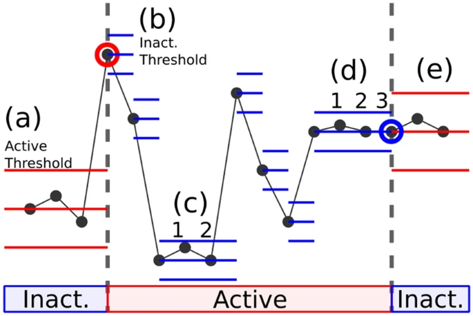
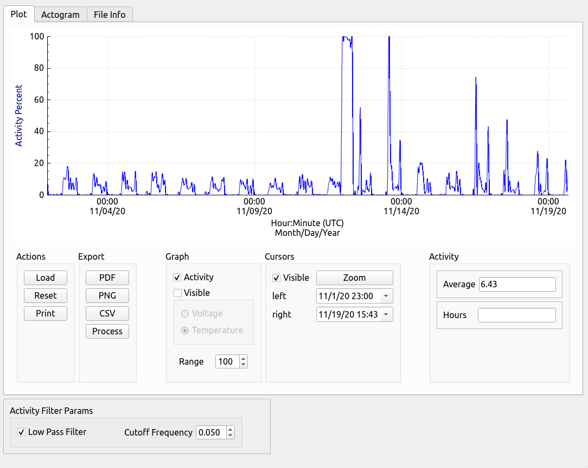
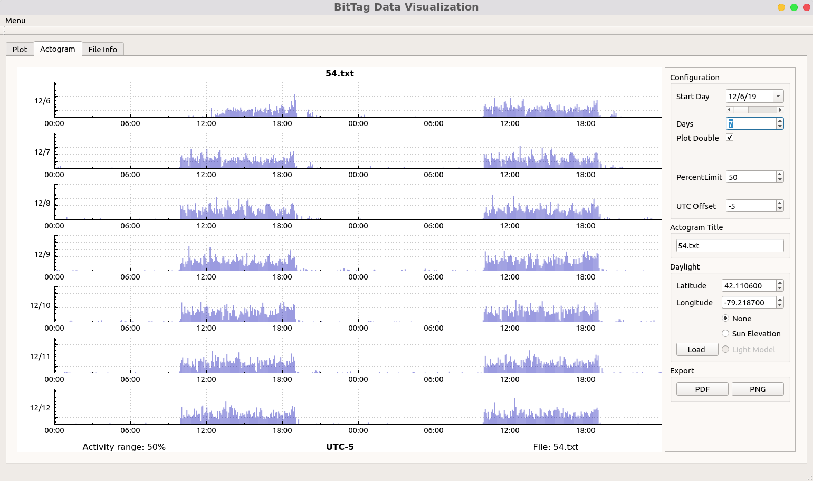
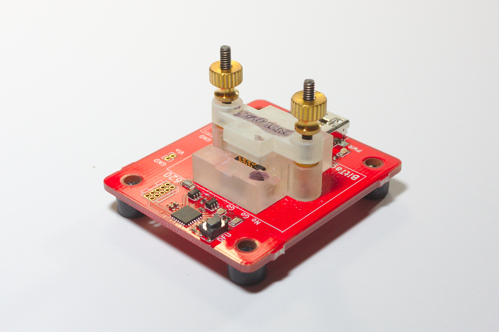
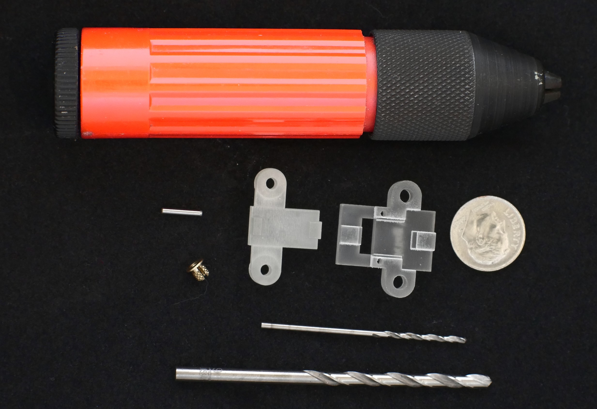
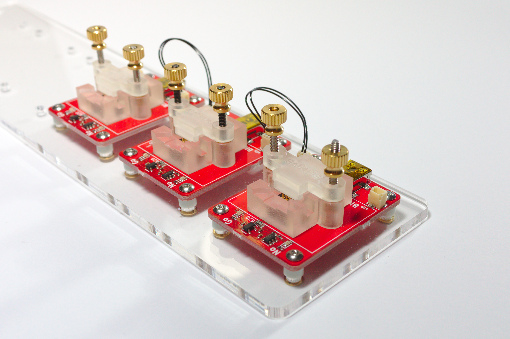
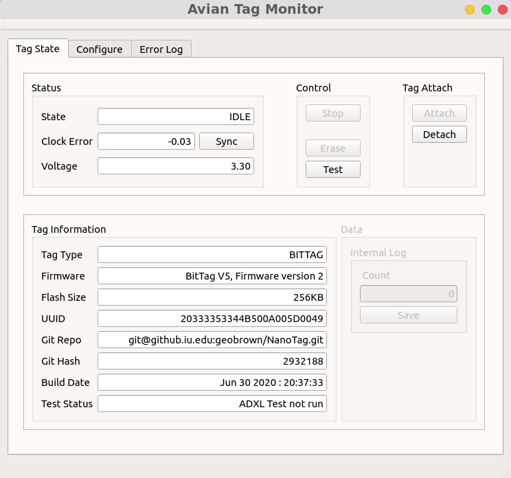
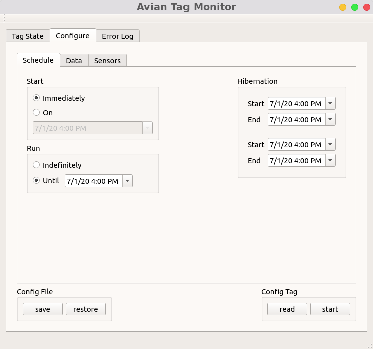
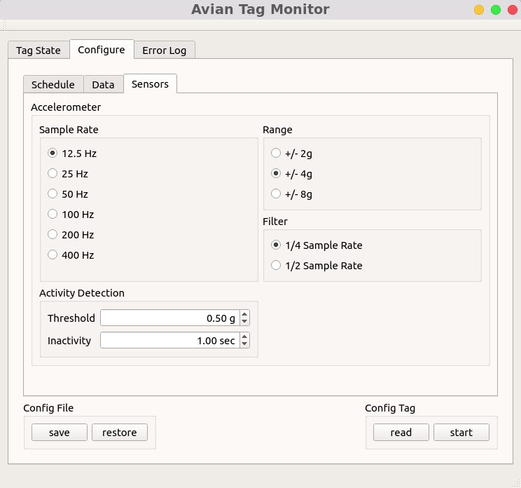

# BitTag

The BitTag is a novel data logger capable of collecting *continuous* activity data for 360 days --
depending upon battery size.  The operational concept is simple -- BitTag contains an accelerometer that
detects movement and, based upon the movement dynamics, determines if the subject animal is active.  Each second BitTag generates a single bit of information -- 1 if the animal is active, 0 if it is it is not.
These bits are aggregated (counted) over a measurement period 1 second to 5 minutes; at the end of each 
aggregation period the counts are stored in non-volatile memory.  The choice of aggregation period depends upon the length of the experiment and is constrained by the amount of available storage -- 248 hours for raw data to 8660 hours for 5 minute aggregation. A later BitTag design adds external memory, which holds 8738 hours of data aggregated over 15 seconds.

BitTag has been used in a variety of experiments with both captive and free animals including monitoring circadian rhythms, determining changes in activity around migration and egg laying, and when migrating animals fly.

The key component in the BitTag is a extremely low energy accelerometer -- the adxl362.   This accelerometer 
has special activity detection hardware that samples current acceleration along 3-axes at 6hz.  When an animal is completely 
still there is 1g acceleration towards the earth due to gravity.  In activity detection mode, the adxl362 tracks acceleration -- when *the change* in acceleration is greater than a configured threshold, the device signals the BitTag processor that the animal is active.  When the acceleration remains within a configured range for a configured time, the BitTag signals that the animal is inactive.

The detection algorithm is illustrated to the right.  Consider a tag with two states -- inactive and active.  An inactive tag (a) remains inactive until it experiences acceleration greater than the "active threshold" (b).  An active tag remains active until it remains within a configured acceleration range for a configured time (d).  Notice that whenever an active tag exceeds the configured threshold, the center of the range moves (c-d).  This tracking hardware is
remarkably low energy (300nA), but very effective at tracking bird activity because flying naturally results in high acceleration changes.

As an example of the type of data that BitTag collects consider the figure on the right which was created with the BitTag visualization tool btviz.   The data illustrate several days during the migration of a
Robin and clearly illustrates a long flight on November 12 with several shorter flights.  Migration during 
this period was confirmed with an attached GPS data logger.  (Figure courtesy of Alex Jahn)

The figure is a screen shot of our visualization tool which enables data exploration by zooming, scrolling, and low-pass filtering. Additional overlay graphs are available to display the tag battery voltage and
temperature.  The former is useful for evaluating the battery discharge rate in long experiments.

<figure style="width: 500px;">
  
  <figcaption>Robin Migration</figcaption>
</figure>

A common way for behavioral scientists to explore activity data is through an "actogram".  The actogram is
organized to display multiple 48-hour periods (two days in a row), with rows beginning on successive days. 
Thus every 24-hour period is displayed twice -- first in the left column and then in the right column.  Our
visualization tool provides ways to customize the view including the number of rows, data scalling, and offset from
UTC time.   Another feature, not displayed here, is the ability to overlay the sun angle based upon a specific location or
a simulation model for indoor studies.

<figure style="width: 500px;">
  
  <figcaption>BitTag Actogram</figcaption>
</figure>

## Tag Infrastructure

The physical design of tags is just a small part of the system design problem.  To
be useful, the tags require a support "ecosystem" that enables tag configuration, 
battery charging, and data recovery.  This ecosystem includes both software (tag firmware,
configuration software, data processing), and support hardware.  For example, we have 
developed a "standard" hardware base to which tags are attached for configuration and
charging.  Variations in battery chemistry necessitate (small) 
hardware differences in the bases -- we use two distinct types of batteries NiMn and LiPo.
Furtunately, these hardware differences are opaque to the system software. 

Of course different tags will have
variations in geometry, thus our base architecture includes a 3D printed adapter that
is tag specific. The adjacent image illustrates one such adapter along
with the hand tools used to finish the commercially printed component.  The tags carry
a small array of "test points" (covered with insulation during flight) through which
all base/tag communication occurs.  The mechanical issues of reliably connecting to 
the tags are considerable and are discussed in [link].

It is worth noting that we face a scale problem -- supporting experiments with dozens of tags
is considerably different than configuring and testing single tags.  For example, consider that
our partners need to prepare groups of 20-100 tags for flight simultaneously.  Simply charging the
tag batteries takes many hours (e.g. overnight), thus we have also developed chargers that can
be "ganged" together and connected by a single USB connection. 

The adjacent image
illustrates three such chargers (only one USB connector is used per 'gang').  These chargers can
be built relatively inexpensively (under \$50/each in small quantities).

<figure style="width: 300px;">
  
  <figcaption>Programmer for BitTags</figcaption>
</figure>

<figure style="width: 300px;">
  
  <figcaption>Tagbase Adapter and Tools</figcaption>
</figure>

<figure style="width: 300px;">
  
  <figcaption>Tag Charger Array</figcaption>
</figure>

## Tag Configuration

The tags that we build are highly configurable.  For example, the BitTags can be configured with various "thresholds" for 
determining when the animal is active, different data aggregation choices (from 1 bit/second to active second counts per 5-minutes),
and complex schedules including hibernation periods.  

The primary tool that we have developed for configuring tags is the "Avian Tag Monitor".  This tool organizes
Tag information as a set of tabs.  The first tab, illustrated on the right, provides information about the specific tag 
including its current state, battery voltage, and clock error as well as details about the hardware and software on the tag.  
This tab also provides various control actions and provides for data download.

<figure style="width: 500px;">
  
  <figcaption>NanoLogger Monitor</figcaption>
</figure>

As mentioned, the tags provide the ability to create complex schedules including start and end times for data collection as well as "hibernation periods" when data collection should be suspended.

<figure style="width: 500px;">
  
  <figcaption>NanoLogger Monitor</figcaption>
</figure>

Modern sensors provide many possible configuration options.  For the BitTag, the accelerometer can be configured with various scales,
sample rates, and thresholds for activity detection.   
The Tag Monitor provides access to these configuration options.

<figure style="width: 500px;">
  
  <figcaption>NanoLogger Monitor</figcaption>
</figure>

The Tag Monitor software is highly configurable and is designed so that it can be extended to support additional types of sensors and 
data storage strategies.  The specific options shown are automatically customized to the tag being configured.   In addition, we provide support for batch testing and configuration of tags through separate command-line tools.

