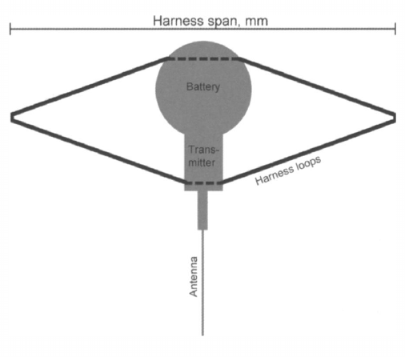
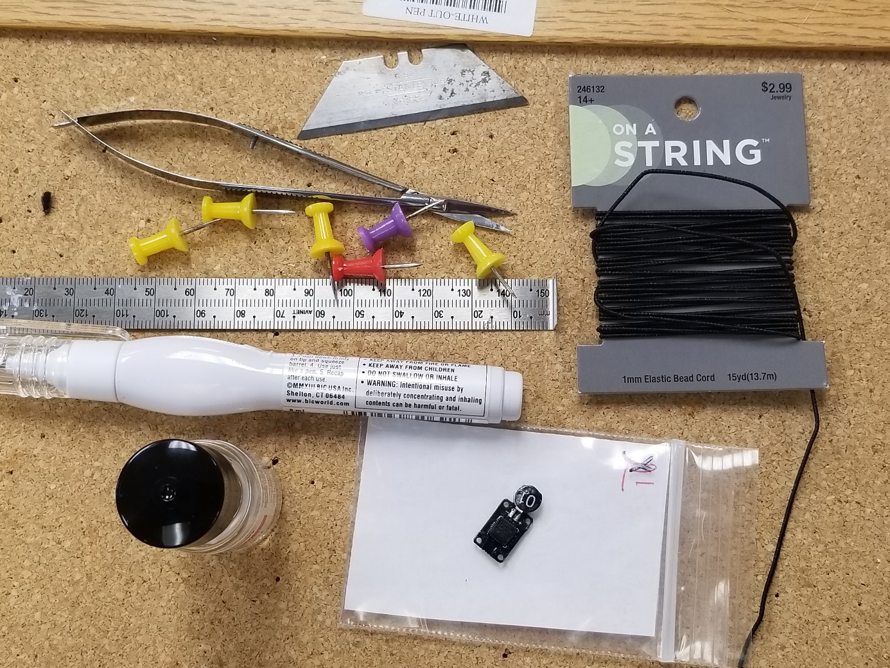
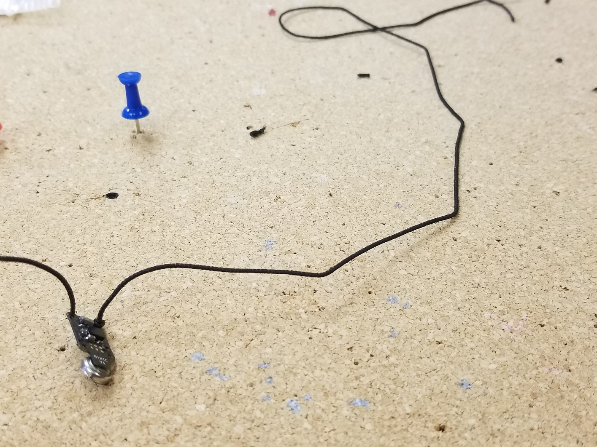
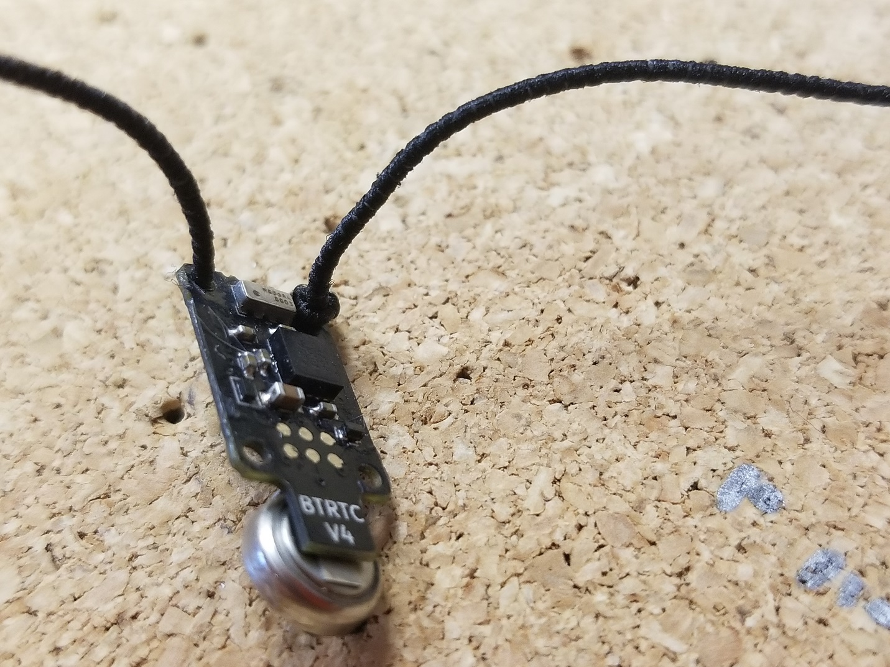
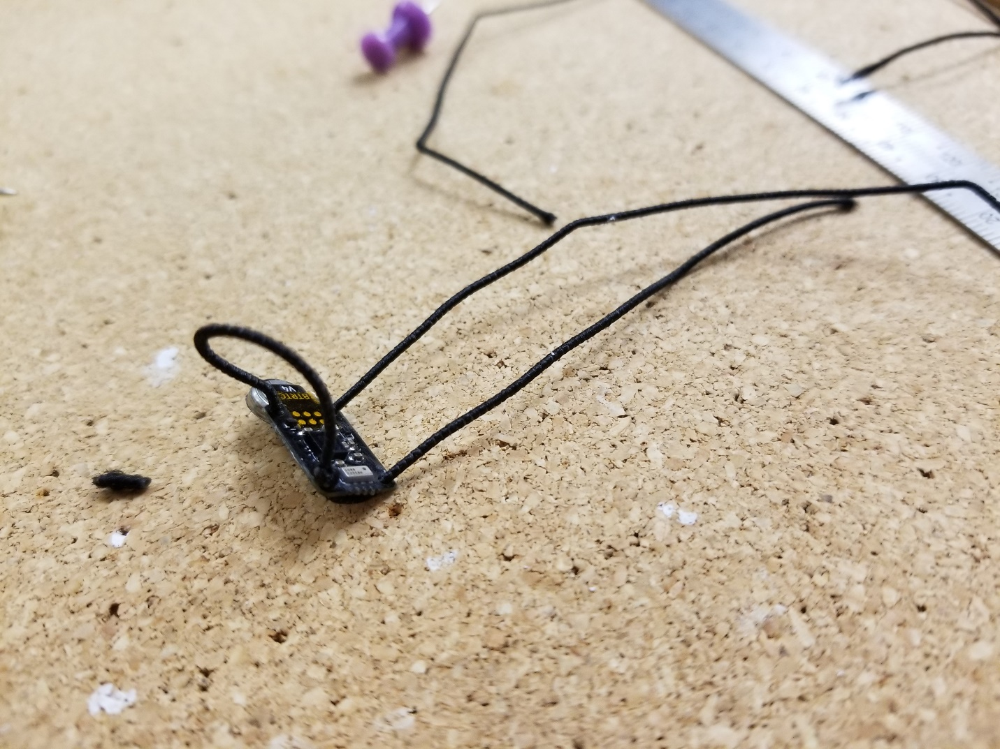
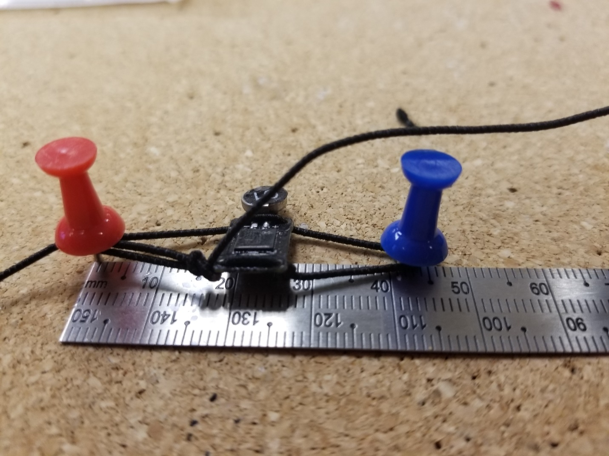
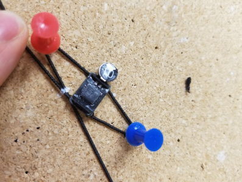
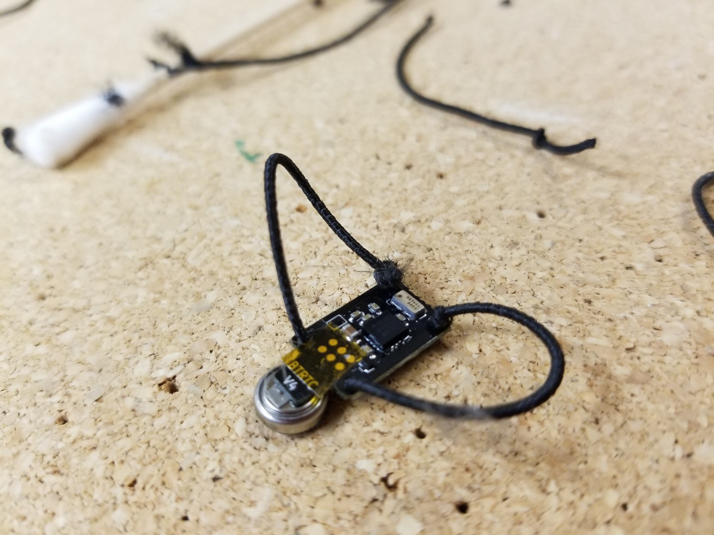
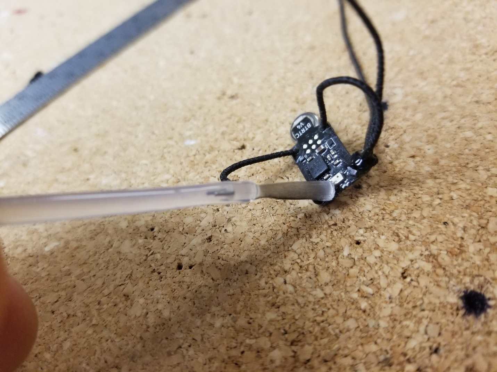
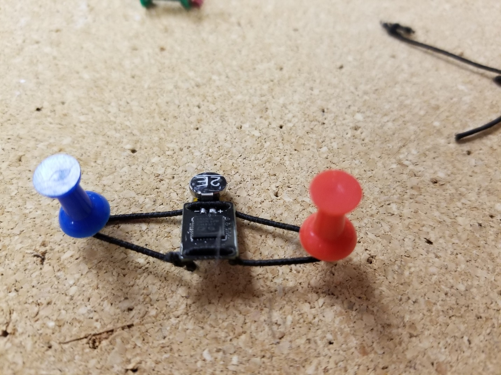

# Loop Harnesses

# Guide to Building Leg Loop Harness For Activity Loggers

*This material adapted from guide written by Dillon Gaugon*

This guide demonstrates a  method to build a leg loop harness for use on birds. 

The following empirical formula, presented in [^1], provides an effective guide for ornithologists seeking to build
harnesses for data loggers and trackers.

$\texttt{harness span} = 14.16 + 8.34*\texttt{body mass}^{0.437}$

The formula, based upon published data from a variety of species should provide a reasonable starting point for size.

[^1]: Naef-Daenzer, Beat. *An allometric function to fit leg-loop harnesses to terrestrial birds*.  **Journal of Avian Biology**, 38:404-407, 2007.

<figure align="center">

<figcaption align="center">Loop Harness: Naef-Daenzer 2007</figcaption>
</figure>

*For application of loggers with animals, an individual with the proper permits and training will need to be found or trained by someone with previous experience.*

## Step 1: Materials

* First, you’ll need to gather your materials
* Six Thumbtacks
* Elastic bead cord 1mm (can be obtained at any arts and crafts store)
* Small scissors or a razor blade (needs to be sharp to cut string)
* Nail Polish (to glue knots together) or super glue
* White paint marker or sharpie (to mark the string)
* Ruler
* A corkboard
* A NanoTag Activity Logger

<figure align=center>

<figcaption align=center>Fig. 1 Loop Harness Materials</figcaption>
</figure>

## Step 2:  Start Building !

* Begin with a size in mind -- you will not be able to measure until later in the process; however, on Juncos we commonly use 42-44mm.
* Put the string through a hole on the opposite side of the battery.
* Put string through and leave about double the length of your desired size. So, for 40mm loggers, leave about 80mm.
* Make sure that the string does not go over the side with the gold dots! These will face down onto the bird’s back.

<figure align=center>

<figcaption align=center>Fig. 2  Start Building</figcaption>
</figure>

## Step 3: Safety Knot !

* Tie a knot at the base of the second hole that you will put the string through. Make sure you still leave plenty of string!
* Make sure it is set up so that the knot will stay at the base.
* To make charging easiest, check that the knot is not on the side with the gold dots!

<figure align=center>

<figcaption align=center>Fig. 3 Safety Knot </figcaption>
</figure>

## Step 4: Finish Threading Loops !

Put the string through the rest of the holes so that two loops can be made.

<figure align=center>

<figcaption align=center>Fig. 4  Finish Threading Loops </figcaption>
</figure>

## Step 5:  Measure Your Harness

* You should have measurements in mind before you start building a harness
* However, you will only be able to get an accurate measurement of harness size at this step
* Take two thumbtacks and place them so that their distance is your desired size
* Place the logger around the two thumbtacks; here it measured below for about 43 mm
* It’s important to note that the logger is not holding itself together yet! The untied portion is being held taught to estimate the desired size.

<figure align=center>

<figcaption align=center>Fig. 5 Measuring the Harness </figcaption>
</figure>

## Step 6:  Mark Your String

* Holding the harness tight, but not too tight, make a mark on the strings so that a knot may be tied on the base of the left side of the logger.
* Again, make sure not to have the string too tight (if the thumbtacks are being pulled off the board, it’s too tight.)

<figure align=center>

<figcaption align=center>Fig. 6 Marking the Harness</figcaption>
</figure>

## Step 7: Tying Off

* Use the white marks to line up the knot to the size you had measured (there will be some estimation involved but you can always refer to your tacks).
* The knots should be tied so that they will stay at the base of the logger (notice the tape, that will need to be applied over the gold dots after charging)
* Make sure to check your size, once you have tightened the knot and cut the extra strings.

<figure align=center>

<figcaption align=center>Fig. 7 Tying the Harness</figcaption>
</figure>

## Step 8: Sealing the Knots

* Apply nail polish to the knots as shown so that the knots will hold.
* It will dry and function as glue (it is also optional to use super glue)
* Try not to use so much that it gets on the rest of the logger.

<figure align=center>

<figcaption align=center>Fig. 8 Sealing the Knots</figcaption>
</figure>

## Step 9: Admire Your Work

* Congratulations! You have finished !
* You can refer to your tacks one last time to make sure that your measurements have been accurate.

<figure align=center>

<figcaption align=center>Fig. 9 Admire Your Work</figcaption>
</figure>

