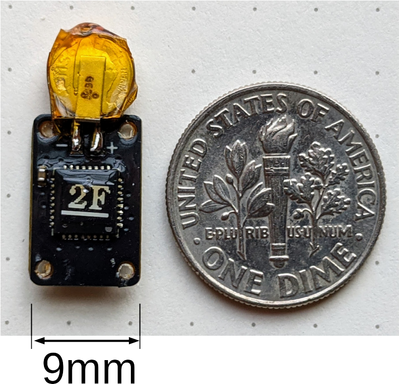

# About

Rapid improvements in low-power, inexpensive, movement and environmental sensors 
has sparked a revolution in animal behavior research by enabling the creation of 
novel data-loggers (tags) that can capture fine-grained activity and 
location data over many months. Nevertheless, development of tags that 
are suitable for use with small species of birds remains challenging because 
of the extreme weight (and hence energy) constraints.

<figure class="ml-2" style="width: 300px;">
  
  <figcaption>Dark-eyed Junco &mdash; <em><a href='https://commons.wikimedia.org/wiki/File:Dark_Eyed_Junco_(197460705).jpeg'> Jocelyn Anderson </a></em></figcaption>
</figure>

This website documents 
the use, design, and fabrication of  custom tags 
below the mass and power budgets of most low-energy devices -- $1g$ and $1\mu W$, respectively --
that can collect continuous data for up to a year.  The tags we present are *archival*, which
means that the data they collect can only be downloaded by retrieving the tags. 
Tags with 
telemetry interfaces are not generally practical for long-lived data collection at the scale we describe.

<figure class="ml-2" style="width: 300px;">
  
  <figcaption>Example Tag</figcaption>
</figure>

Our 
biology partners study the behavior and ecology of 
dark-eyed juncos ($20-25g$), pine siskins ($12-18g$), great tits ($16-21g$), and robins. 
[Cornell Lab of Ornithology 2019](#ref-cornelllabofornithology2019aab)

Cornell Lab of Ornithology (2019). All about birds. *All About Birds*. <https://www.allaboutbirds.org>
{: .reference }

